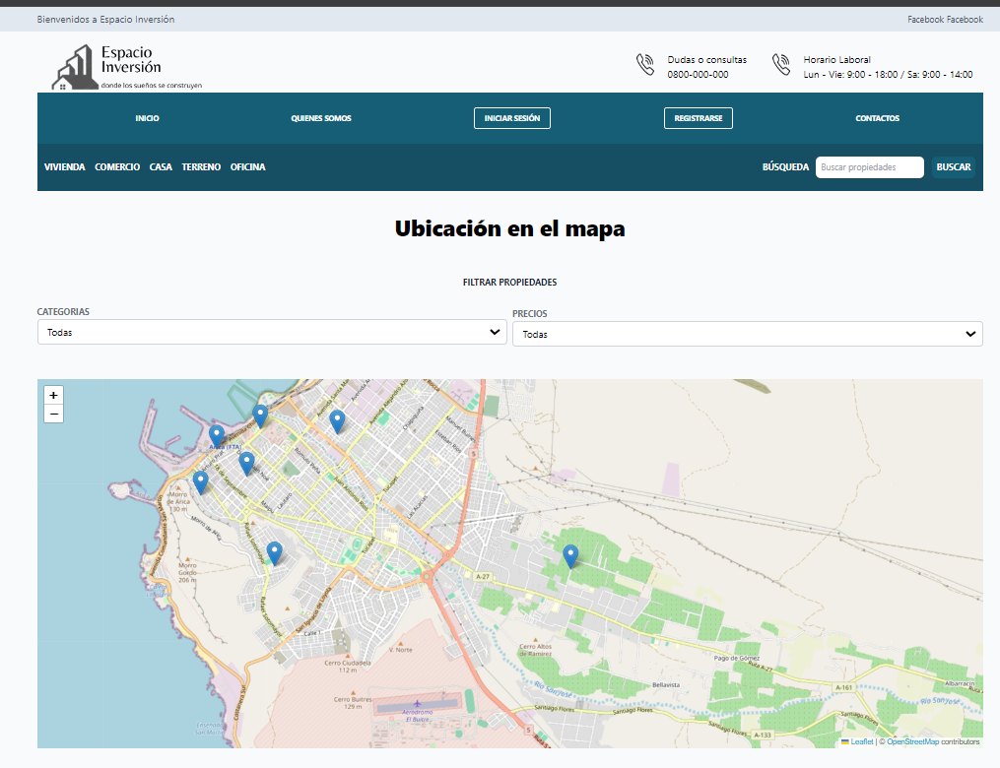

# Espacio Inversión - Venta de Inmuebles

Este proyecto consiste en un sitio web de venta de inmuebles. Permite publicar tus propiedades en ventas.

## Descripción del proyecto:

Este proyecto busca no solo hacer un página funcional sino utilizar diversas herramientas tanto del lado del Frontend como del Backend y Base de Datos Postgres.  Es un proyecto que será creciendo y agregando nuevas funcionalidades y mejorars


## Capturas de Pantalla del Proyecto



Vista inicio de la aplicación.


Registro de usuarios.


Registrar Propiedades


Registrar Propiedades


Registrar Propiedades


## Prerrequisitos o Dependencias

Lista de software y herramientas, incluyendo versiones, que necesitas para instalar y ejecutar este proyecto:
- bcrypt: "^5.1.1",
- cookie-parser: "^1.4.6",
- dotenv: "^16.4.5",
- express: "^4.19.2",
- express-fileupload: "^1.5.0",
- express-handlebars: "^7.1.3",
- express-validator: "^7.1.0",
- jsonwebtoken: "^9.0.2",
- nodemailer: "^6.9.14",
- pg: "^8.12.0",
- uuid: "^10.0.0"

## Instalación del Proyecto

Una guía paso a paso sobre cómo configurar el entorno de desarrollo e instalar todas las dependencias.

1. Copiar el repositorio:

```bash
# git@github.com:hernandw/bienesraices-hbs.git
```

2. Clona en tu computadora

```bash
# git clone git@github.com:hernandw/bienesraices-hbs.git
```

## Instrucciones para Ejecutar el Proyecto

3. Instala las dependencias del proyecto

```bash
# npm install
```

4. Configura las variables de entorno en tu máquina

```
 
DB_USER=
DB_PASSWORD=
DB_HOST=
DB_DATABASE=
DB_PORT=

PORT=

JWT_SECRET_KEY=

--Debes obtener una api_key de https://hed9q8m1deoiljc1.maps.arcgis.com/home/index.html 

API_KEY=

--Debes crear una cuenta en mailtrap o brevo

EMAIL_HOST=
EMAIL_PORT=
EMAIL_USER=
EMAIL_PASS=


FRONTEND_URL=http://localhost
```

## Instrucciones para Cargar la Base de Datos o Migrar los Modelos

Instrucciones necesario para cargar la base de datos o migrar los modelos de datos.

5. crea la base de datos SQL postgres en tu herramienta de preferencia

```bash
# create database bienesraices
```

## Instrucciones para Cargar los Datos Semilla a la Base de Datos

Comandos necesario para cargar los datos semilla a la base de datos.

6. Crea las tablas y carga los datos iniciales con el siguiente comando:

```bash
# npm run tables
```

Ya casi listo solo debes levantar el proyecto con el siguiente comando...

```bash
# npm run dev
```


- **Williams Hernández**  - [Williams Hernández](https://github.com/hernandw)

## Licencia

Este proyecto está bajo la Licencia MIT - ve el archivo [license.md](LICENSE) para detalles

---

## Consejos Adicionales

Puedes contribuir al proyecto con un PR

La BBDD está en https://neon.tech/
El deploy del proyecto está en render.com

---

⌨️ con ❤️ por [Williams Hernández](https://github.com/hernandw) 😊
